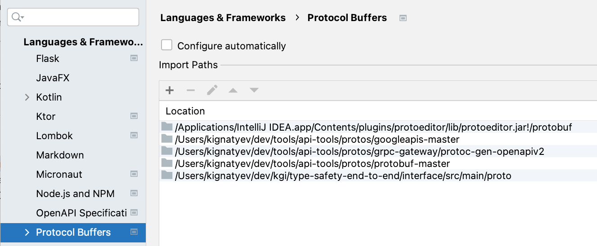

EMA API
---

This project supports defining API via protobufs for simplicity of development and then
generates versioned OpenAPI specifications. It gets published via GitHUB pages

Updating API spec
---

Make necessary changes to API and then

    ./build.sh <version>
    git commit -a -m 'api updates'

Editing Specs.

   To simplify coding, please checkout [API tools](https://gitlab.com/Xpansiv/api-tools) project and  configure IntelliJ IDE like this (adjusting paths):
   

